# 16模块图像中遇到的问题集合
探测器几何：

* L=33.4mm
* I_radius=99mm
* num_ring=1
* num_block_per_ring=16
* block_size=20\*33.4\*33.4 mm3
* block_grid=1\*10\*10
* crystal_size=20\*3.34\*3.34 mm3

重建图像：

* image_size= 167\*167\*33.4 mm3
* image_grid= 100\*100\*10

重建图像如下：

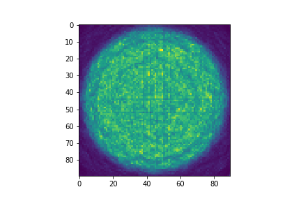
.png)
.png)

实际数据中也是有相同的问题

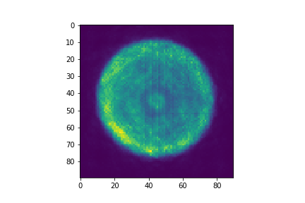
.png)
.png)

## 重建图像横竖黑线问题
原因说明：当晶体crystal size为图像pixel size的倍数（2倍）时，会出现有规律的横竖黑线问题；当z轴方向pixel size等于crystal size时，黑线问题最严重。
解决方法：
a.改变图像pixel size的尺寸，使之与crystal size不成倍数关系
下图是将每个pixel size大小设置为2 mm\*2 mm\*2 mm,得到结果

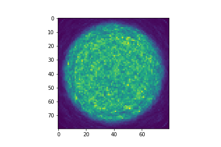
.png)
.png)

b.将每个晶体上的事件的位置作高斯分布，而非归类到晶体中心位置
该步骤中做了简化，由于仿真结果中得到的是精确的光子坐标，因此在重建中使用实际光子位置，而不需要将所有事件定位到晶体中心位置。得到结果如下：

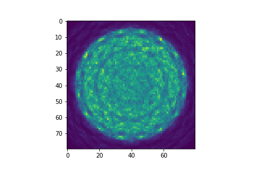
.png)
.png)

## 重建图像中黑色圆环问题
原因说明：当每个block上的晶体数量为10\*10或者20\*20的时候，出现圆环状的伪影。
解决方法：
a.将每个block上的晶体数量改为15\*15
下图是重建结果:

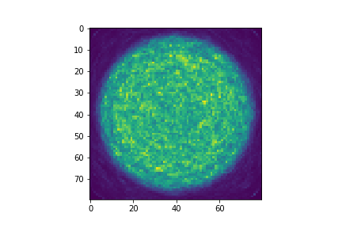
.png)
.png)

## 重建图像中边缘局部最亮点问题
原因说明：
SRF siddon中的边缘处没有出现亮点的情况，因此认为可能是原来的bbs或者lmrec中的程序bug导致，但是具体bug位置需要仔细对比两块程序

# 16模块实际数据重建结果记录
重建图像：

* image_size= 180\*180\*20 mm3
* image_grid= 90\*90\*10

## 12 cm直径flood phantom重建图像
重建结果如下所示：

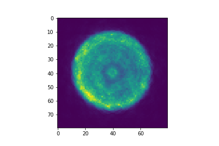
.png)
.png)

## 15 cm直径flood phantom重建图像
重建结果如下所示：

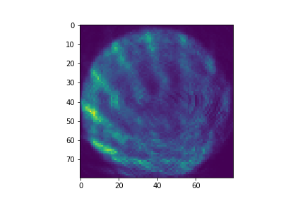
.png)
.png)

其中两两模块之间符合事件统计如下所示：

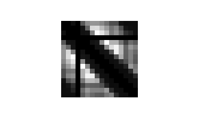

手动使用其他模块数据补充到第4模块，得到的两两模块之间符合事件统计如图：

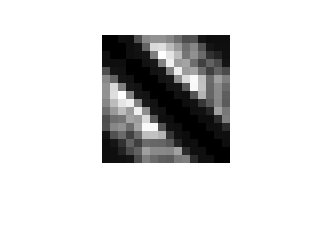

得到的相应重建结果如下图所示：

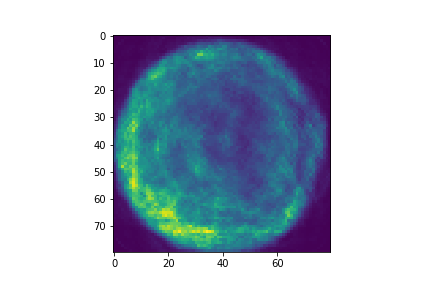
.png)
.png)

第4模块符合事件少的原因:
第4模块能量分布很低，其峰值位置在265左右，因此，在使用能量窗时导致事件被过滤掉
下图是第4模块上事件的能量分布和13模块上事件的能量分布:

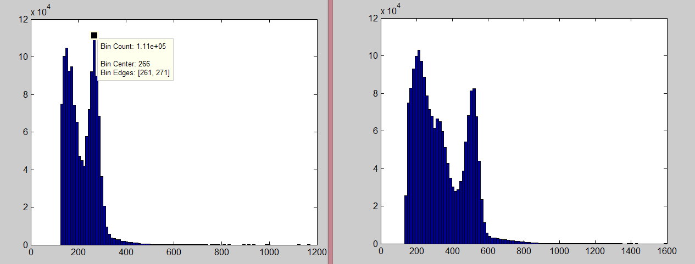

需要对4模块数据的能量做校正

##  18 cm直径flood phantom重建图像
重建结果如下所示：

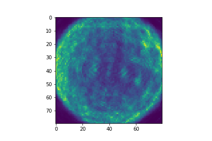
.png)
.png)

