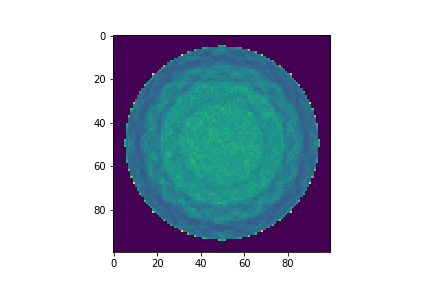

# 16模块图像中遇到的问题集合
探测器几何：

* L=33.4mm
* I_radius=99mm
* num_ring=1
* num_block_per_ring=16
* block_size=20\*33.4\*33.4 mm3
* block_grid=1\*10\*10
* crystal_size=20\*3.34\*3.34 mm3

重建图像：

* image_size= 167\*167\*33.4 mm3
* image_grid= 100\*100\*10

重建图像如下：

.png)
.png)

实际数据中也是有相同的问题

.png)
.png)

## 重建图像横竖黑线问题
原因说明：当晶体crystal size为图像pixel size的倍数（2倍）时，会出现有规律的横竖黑线问题；当z轴方向pixel size等于crystal size时，黑线问题最严重。
解决方法：
a.改变图像pixel size的尺寸，使之与crystal size不成倍数关系
下图是将每个pixel size大小设置为2 mm\*2 mm\*2 mm,得到结果

.png)
.png)

b.将每个晶体上的事件的位置作高斯分布，而非归类到晶体中心位置
该步骤中做了简化，由于仿真结果中得到的是精确的光子坐标，因此在重建中使用实际光子位置，而不需要将所有事件定位到晶体中心位置。得到结果如下：

.png)
.png)

## 重建图像中黑色圆环问题
原因说明：当每个block上的晶体数量为10\*10或者20\*20的时候，出现圆环状的伪影。
解决方法：
将每个block上的晶体数量改为15\*15
下图是重建结果:

.png)
.png)

情况依然存在,针对图像中黑色圆环的问题，做出以下比较：
a.mct系统
* L=220mm
* I_radius=424.5mm
* num_ring=4
* num_block_per_ring=48
* block_size=20\*53.3\*53.3 mm3
* block_grid=1\*13\*13
* crystal_size=20\*4\*4 mm3
* R_phantom=35cm

* image_size= 800\*800\*220 mm3
* image_grid= 200\*200\52

下图是重建结果:

.png)
.png)

b.hrrt系统
* L=253.5mm
* I_radius=234.5mm
* num_ring=1
* num_block_per_ring=8
* block_size=20\*175.5\*253.5 mm3
* block_grid=1\*72\*104
* crystal_size=20\*2.2\*2.2 mm3
* R_phantom=35cm

* image_size= 800\*800\*133.6 mm3
* image_grid= 200\*200\*10

下图是重建结果:

.png)
.png)

c.16module等比例放大到mct尺寸
* L=140mm
* I_radius=426mm
* num_ring=1
* num_block_per_ring=16
* block_size=20\*133.6\*133.6 mm3
* block_grid=1\*10\*10
* crystal_size=20\*12\*12 mm3
* R_phantom=35cm

* image_size= 800\*800\*133.6 mm3
* image_grid= 200\*200\*10

下图是重建结果:

.png)
.png)

d.mct等比例缩小到16module尺寸
* L=55mm
* I_radius=98.6mm
* num_ring=4
* num_block_per_ring=48
* block_size=20\*13.325\*13.325 mm3
* block_grid=1\*13\*13
* crystal_size=20\*1\*1 mm3
* R_phantom=9cm

* image_size= 200\*200\*55 mm3
* image_grid= 100\*100\*52

下图是重建结果:

.png)
.png)

e.16module补上空缺位置
* L=33.4mm
* I_radius=99mm
* num_ring=1
* num_block_per_ring=16
* block_size=20\*39.36\*33.4 mm3
* block_grid=1\*12\*10
* crystal_size=20\*3.34\*3.34 mm3
* R_phantom=9cm

* image_size= 200\*200\*33.4 mm3
* image_grid= 100\*100\*10

下图是重建结果:

.png)
.png)

f.16module空缺更大
* L=33.4mm
* I_radius=99mm
* num_ring=1
* num_block_per_ring=16
* block_size=20\*26.72\*33.4 mm3
* block_grid=1\*8\*10
* crystal_size=20\*3.34\*3.34 mm3
* R_phantom=9cm

* image_size= 200\*200\*33.4 mm3
* image_grid= 100\*100\*10

下图是重建结果:

.png)
.png)

g.16module环形模块
* L=33.4mm
* I_radius=99mm
* num_ring=1
* num_block_per_ring=160
* block_size=20\*3.34\*33.4 mm3
* block_grid=1\*1\*10
* crystal_size=20\*3.34\*3.34 mm3
* R_phantom=9cm

* image_size= 200\*200\*33.4 mm3
* image_grid= 100\*100\*10

下图是重建结果:

.png)
.png)

h.16module单环模拟
* L=33.4mm
* I_radius=99mm
* num_ring=1
* num_block_per_ring=160
* block_size=20\*33.4\*3.34 mm3
* block_grid=1\*10\*1
* crystal_size=20\*3.34\*3.34 mm3
* R_phantom=9cm

* image_size= 200\*200\*3.34 mm3
* image_grid= 100\*100\*1

下图是重建结果:

以上数据是GATE模拟，siddon重建结果。以下测试计算出系统矩阵A,使用A\*X直接生成投影数据,加入泊松噪声,并使用系统矩阵完成重建。
下图是重建结果:

使用上述计算出系统矩阵，对仿真数据进行重建(去除random事件，约占50%)
下图是重建结果:

将两数据sinogram进行对比:

a.二值化
下图顺序为解析数据，仿真数据，差值

b.均值相等
顺序同上

相应的histogram

## 重建图像中边缘局部最亮点问题
原因说明：
SRF siddon中的边缘处没有出现亮点的情况，因此认为可能是原来的bbs或者lmrec中的程序bug导致，但是具体bug位置需要仔细对比两块程序

# 16模块实际数据重建结果记录
重建图像：

* image_size= 180\*180\*20 mm3
* image_grid= 90\*90\*10

## 12 cm直径flood phantom重建图像
重建结果如下所示：

.png)
.png)

## 15 cm直径flood phantom重建图像
重建结果如下所示：

.png)
.png)

其中两两模块之间符合事件统计如下所示：

手动使用其他模块数据补充到第4模块，得到的两两模块之间符合事件统计如图：

得到的相应重建结果如下图所示：

.png)
.png)

第4模块符合事件少的原因:
第4模块能量分布很低，其峰值位置在265左右，因此，在使用能量窗时导致事件被过滤掉
下图是第4模块上事件的能量分布和13模块上事件的能量分布:

需要对4模块数据的能量做校正,得到重建结果如下图所示：

不仅如此,根据jason描述，每个模块中的各个通道的能量谱峰也有很大的差异，因此需要对每个通道进行能量的增益校准

##  18 cm直径flood phantom重建图像
重建结果如下所示：

.png)
.png)

## 12 cm直径flood phantom重建图像(121013数据)

## 对各通道进行能量增益校正
