#experiment
##configuration 1--------no theta no loss2d
### scatter iamge
scatter image of the original config without theta and loss2d:

first line ---- by applying model to train_com.h5 the scatter of cos distance(btween pos-origin and direction) and distance

second line ---- by applying model to valid_com.h5 the scatter of cos distance(btween pos-origin and direction) and distance

third line ---- by applying model to test_com.h5 the scatter of cos distance(btween pos-origin and direction) and distance
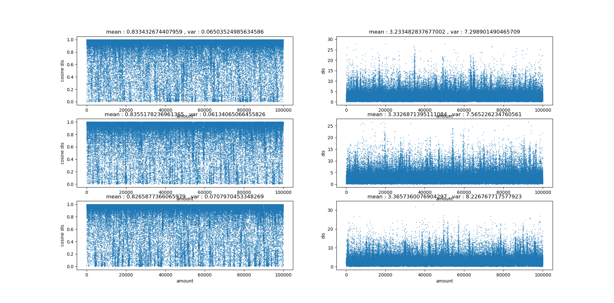
### discrete distribution
discrete distribution image:(`axis y denotes frequency,axis x denotes value range`)

left: cos distance distribution
right: distance distribution

top to down : train,valid,test

### quantile image
`axis y denotes the value of cos distance or distance axis x denotes percent of data`

for example: in the first fig 1 `x=0.2 y=0.713` means `20%` of data got cos distance `< 0.713` also
means `80%` of data got cos distance `> 0.713`
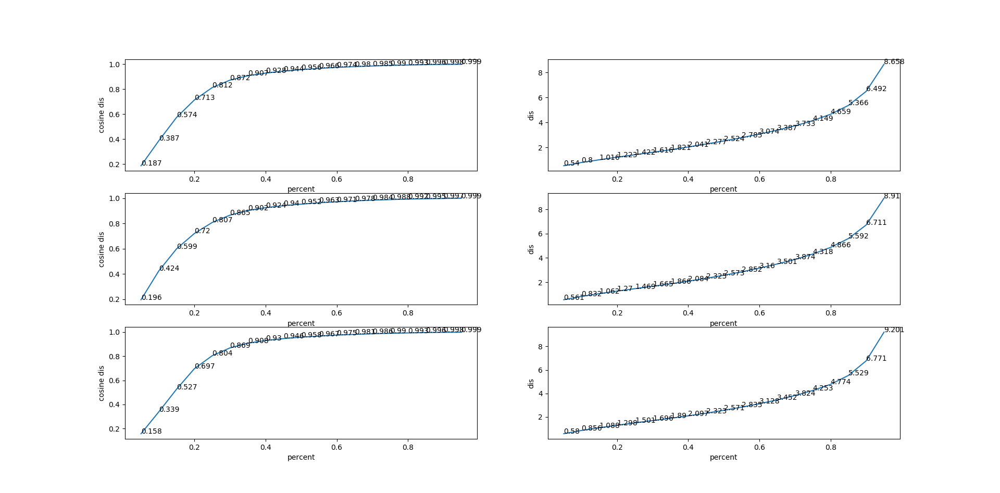
##configuration 2--------with theta no loss2d
### scatter iamge
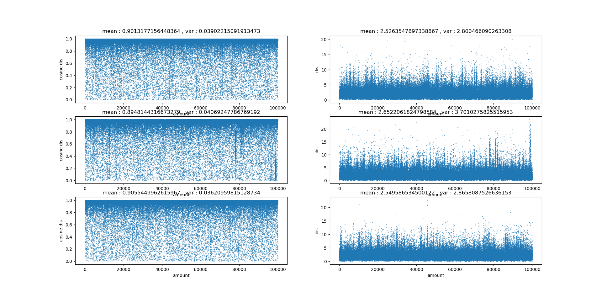
### discrete distribution
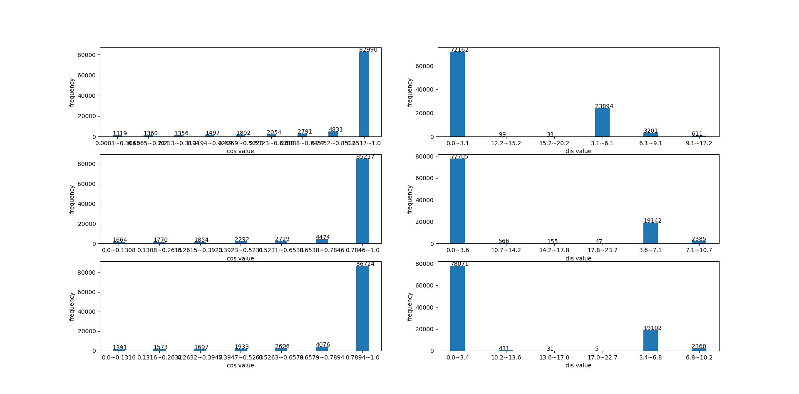
### quantile image
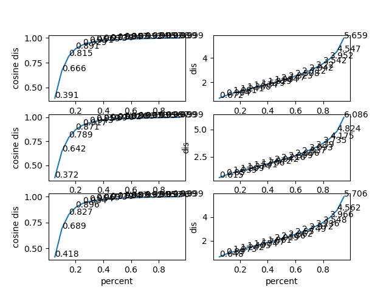
##configuration 3--------without theta with loss2d
### scatter iamge
first two : model on train data

second two: model on valid data

third two : model on test data

every two lines denote:

----line 1: calculation of cos distance/distance in full 3d information 

----line 2: projection to 2d then calculation of cos distance/distance 
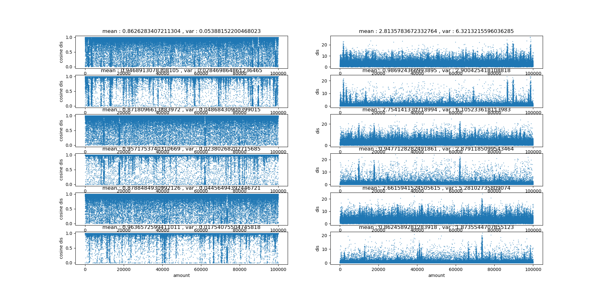
### discrete distribution
first two : model on train data

second two: model on valid data

third two : model on test data

every two lines denote:

----line 1: discrete distribution of cos distance/distance in full 3d information 

----line 2: discrete distribution of cos distance/distance projected to 2d
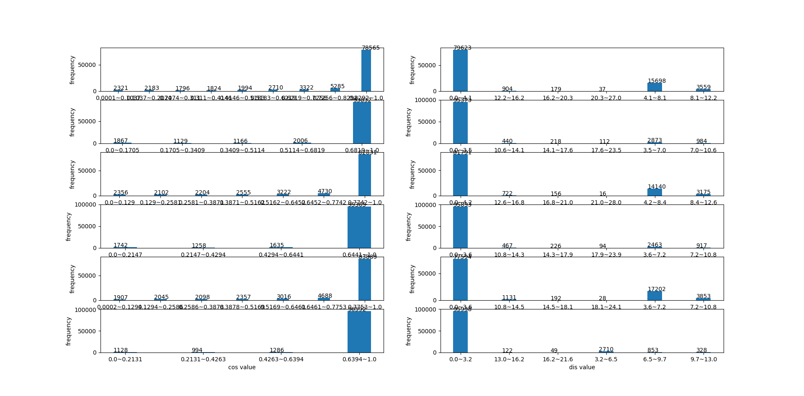
### quantile image
first two : model on train data

second two: model on valid data

third two : model on test data

every two lines denote:

----line 1: quantile image of cos distance/distance in full 3d information 

----line 2: quantile image of cos distance/distance projected to 2d
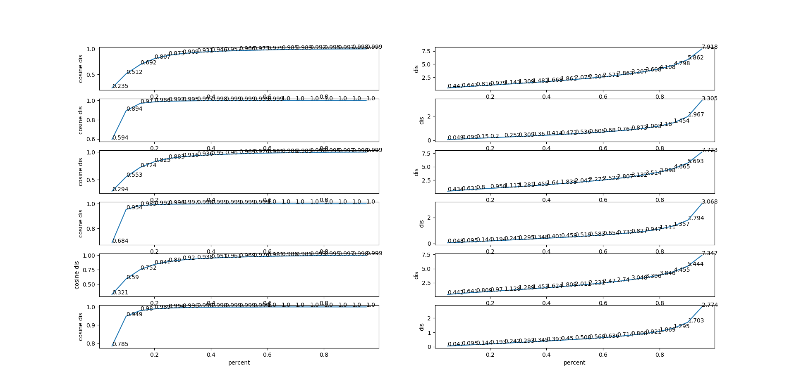
##configuration 4--------with theta with loss2d
### scatter image
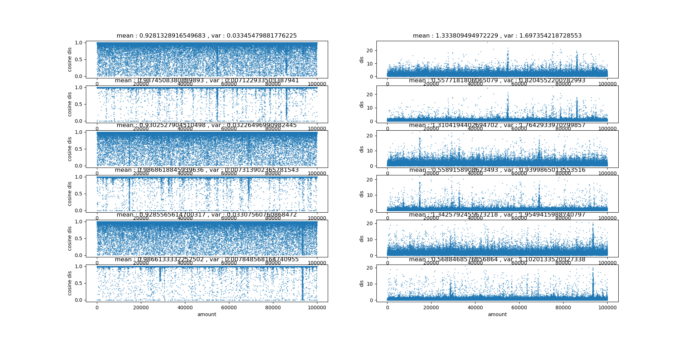
### discrete distribution
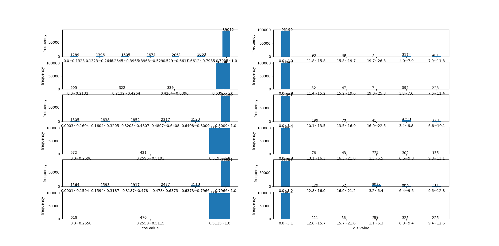
### quantile image
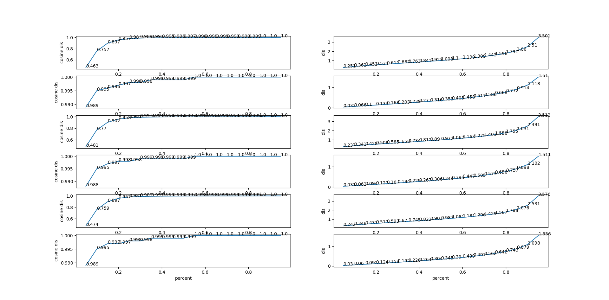

#conclusion
1: model with theta features outperform that without theta.

2: using 2d->3d training strategy works out better than directly minimizing 3d loss .

3: the model combined with theta and 2d->3d strategy is the best configuration.