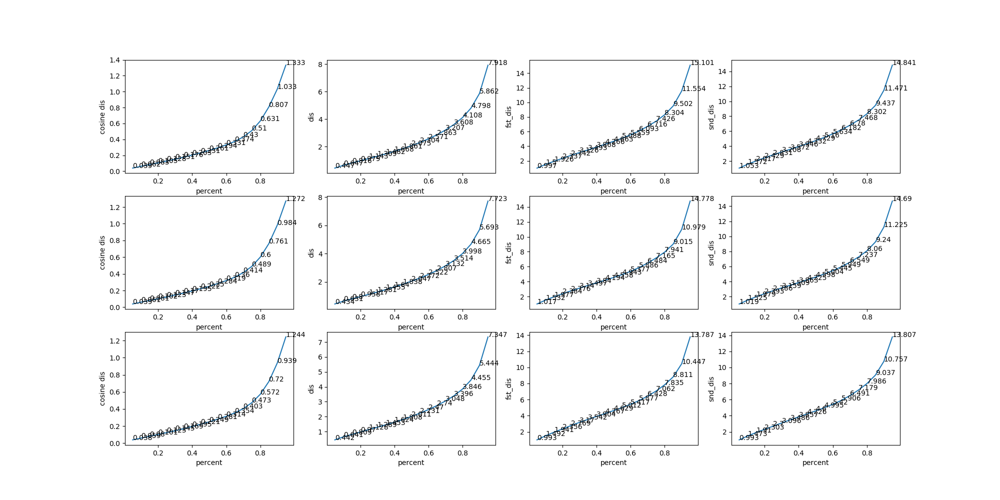

#experiment
cos distance : actually is the angle value.

distance : euclidean distance between pos and inferring line.

fst distance : euclidean distance between fst and fst intersection of inferring line and container. 

snd distance : euclidean distance between snd and snd intersection of inferring line and container. 
##configuration 1--------no theta no loss2d
### scatter iamge
scatter image of the original config without theta and loss2d:

first line ---- by applying model to train_com.h5 the scatter of `cos distance,distance,fst dis,snd dis`.

second line ----applying model to valid_com.h5

third line ---- applying model to test_com.h5

### discrete distribution
discrete distribution image:(`axis y denotes frequency,axis x denotes value range`)

top to down : train,valid,test

### quantile image
`axis y denotes the value of angle or distance axis x denotes percent of data`

for example: in the first fig 1 `x=0.2 y=0.713` means `20%` of data got cos distance `< 0.713` also
means `80%` of data got cos distance `> 0.713`

##configuration 2--------with theta no loss2d
### scatter iamge

### discrete distribution

### quantile image

##configuration 3--------without theta with loss2d
### scatter iamge

### discrete distribution

### quantile image

##configuration 4--------with theta with loss2d
### scatter image

### discrete distribution

### quantile image

#conclusion
1: model with theta features outperform that without theta.

2: using 2d->3d training strategy works out better than directly minimizing 3d loss .

3: the model combined with theta and 2d->3d strategy is the best configuration.